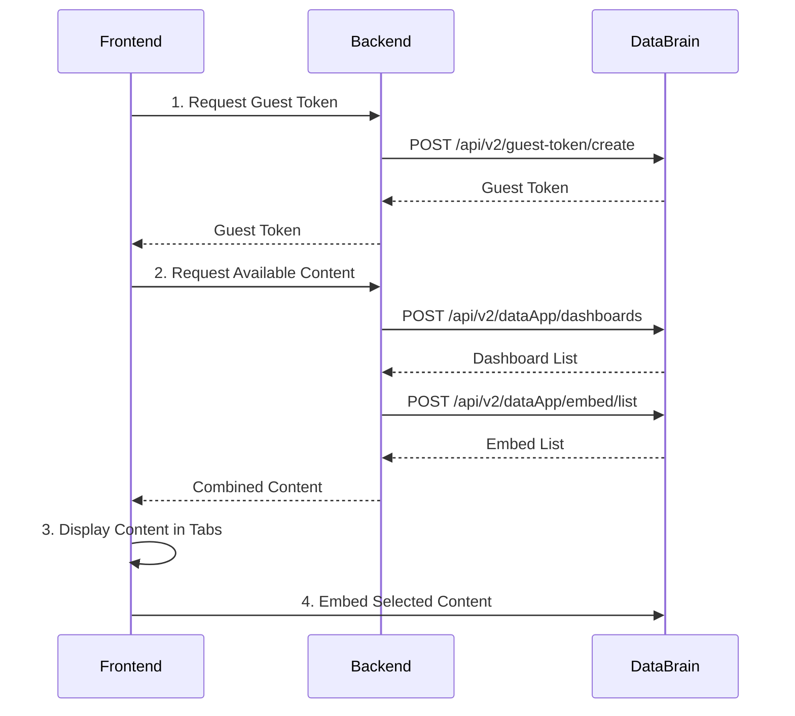

# DataBrain API Integration Flow Guide

A comprehensive guide for implementing the complete DataBrain embedded analytics flow using v2 APIs.

## Overview

This guide demonstrates the proper sequence for integrating DataBrain's embedded analytics into your application. The flow consists of four main steps that work together to provide a complete embedded analytics experience.

## API Flow Sequence



## Step-by-Step Implementation

### Step 1: Guest Token Generation

Create secure authentication tokens for embedded content access.

**Backend Implementation:**

```javascript
app.post('/api/dashboard-guest-token', async (req, res) => {
  try {
    const { clientId, customerId } = req.body;

    const requestBody = {
      clientId: clientId,
      dataAppName: 'your-data-app-name',
      // Include RLS settings for customer data filtering
      ...(customerId && {
        params: {
          rlsSettings: [
            {
              values: {
                "customer id": customerId
              }
            }
          ]
        }
      })
    };

    const response = await fetch('https://uat-api.usedatabrain.com/api/v2/guest-token/create', {
      method: 'POST',
      headers: {
        'Authorization': `Bearer ${DATABRAIN_API_TOKEN}`,
        'Content-Type': 'application/json'
      },
      body: JSON.stringify(requestBody)
    });

    const data = await response.json();
    
    if (response.ok && (data.guest_token || data.token)) {
      res.json({
        success: true,
        guestToken: data.guest_token || data.token,
        clientId: clientId,
        customerId: customerId
      });
    } else {
      res.status(response.status).json({
        success: false,
        error: data.error || 'Failed to create guest token'
      });
    }
  } catch (error) {
    res.status(500).json({
      success: false,
      error: 'Internal server error',
      details: error.message
    });
  }
});
```

**Key Points:**
- Use your Data App's API token for authentication
- Include `clientId` for tenant identification
- Add `rlsSettings` for row-level security when needed
- Handle both `guest_token` and `token` response formats

### Step 2: Fetch Dashboards by Data App

Retrieve all dashboards available in your data app.

**API Reference:** [Fetch Dashboards by Data App](https://docs.usedatabrain.com/developer-docs/helpers/api-reference/fetch-dashboards-by-datapp)

```javascript
// Fetch dashboards from your data app
const dashboardsResponse = await fetch('https://uat-api.usedatabrain.com/api/v2/dataApp/dashboards', {
  method: 'POST',
  headers: {
    'Authorization': `Bearer ${DATABRAIN_API_TOKEN}`,
    'Content-Type': 'application/json'
  },
  body: JSON.stringify({
    isPagination: false
    // Optional: Add filters for specific dashboards
    // filters: {
    //   dashboardNames: ["Sales Dashboard", "Marketing Analytics"]
    // }
  })
});

const dashboardsData = await dashboardsResponse.json();

// Transform for frontend use
const dashboards = dashboardsData.data.map(dashboard => ({
  embedId: dashboard.embedId || dashboard.externalDashboardId,
  name: dashboard.name,
  embedType: 'dashboard',
  metadata: {
    externalDashboardId: dashboard.externalDashboardId,
    ...dashboard
  },
  isDashboard: true,
  isMetric: false
}));
```

### Step 3: List All Embeds

Fetch comprehensive embed configurations including both dashboards and metrics.

**API Reference:** [List All Embeds](https://docs.usedatabrain.com/developer-docs/helpers/api-reference/list-embed)

```javascript
// Fetch all embed configurations
const embedsResponse = await fetch('https://uat-api.usedatabrain.com/api/v2/dataApp/embed/list', {
  method: 'POST',
  headers: {
    'Authorization': `Bearer ${DATABRAIN_API_TOKEN}`,
    'Content-Type': 'application/json'
  },
  body: JSON.stringify({
    isPagination: false
  })
});

const embedsData = await embedsResponse.json();

// Transform embeds for frontend
const embeds = embedsData.data.map(embed => ({
  embedId: embed.embedId,
  name: embed.externalDashboard?.name || embed.externalMetric?.name || 'Unnamed',
  embedType: embed.embedType,
  metadata: {
    ...(embed.externalDashboard?.metadata || {}),
    ...(embed.externalMetric || {}),
    createdAt: embed.externalDashboard?.metadata?.createdAt,
    updatedAt: embed.externalDashboard?.metadata?.updatedAt
  },
  isDashboard: embed.embedType === 'dashboard',
  isMetric: embed.embedType === 'metric'
}));

// Combine and deduplicate
const allEmbeds = [...dashboards];
embeds.forEach(embed => {
  if (!allEmbeds.find(existing => existing.embedId === embed.embedId)) {
    allEmbeds.push(embed);
  }
});
```

### Step 4: Display Content in Organized Tabs

Create an intuitive interface for users to browse and select content.

**Frontend Implementation (React + shadcn/ui):**

```tsx
import { Tabs, TabsContent, TabsList, TabsTrigger } from "@/components/ui/tabs";
import { Card, CardContent, CardDescription, CardHeader, CardTitle } from "@/components/ui/card";
import { Badge } from "@/components/ui/badge";

const DashboardSelector = ({ embeds, onSelect }) => {
  const dashboards = embeds.filter(embed => embed.isDashboard);
  const metrics = embeds.filter(embed => embed.isMetric);

  return (
    <Tabs defaultValue="dashboard">
      <TabsList>
        <TabsTrigger value="dashboard">
          Dashboards ({dashboards.length})
        </TabsTrigger>
        <TabsTrigger value="metrics">
          Metrics ({metrics.length})
        </TabsTrigger>
        <TabsTrigger value="create">
          Create New
        </TabsTrigger>
      </TabsList>

      <TabsContent value="dashboard">
        <div className="grid grid-cols-1 md:grid-cols-2 lg:grid-cols-3 gap-4">
          {dashboards.map(dashboard => (
            <Card
              key={dashboard.embedId}
              className="cursor-pointer hover:shadow-md transition-shadow"
              onClick={() => onSelect(dashboard.embedId, dashboard.name)}
            >
              <CardHeader>
                <CardTitle className="text-sm">{dashboard.name}</CardTitle>
              </CardHeader>
              <CardContent>
                <CardDescription>
                  {dashboard.metadata?.description || 'No description provided.'}
                </CardDescription>
                <div className="mt-2 flex flex-wrap gap-1">
                  <Badge variant="secondary">{dashboard.embedType}</Badge>
                  {dashboard.metadata?.isPrivate && (
                    <Badge variant="outline">Private</Badge>
                  )}
                </div>
              </CardContent>
            </Card>
          ))}
        </div>
      </TabsContent>

      <TabsContent value="metrics">
        {/* Similar structure for metrics */}
      </TabsContent>
    </Tabs>
  );
};
```

## Complete Backend Endpoint

Here's the complete backend implementation that combines all steps:

```javascript
app.post('/api/list-embeds', async (req, res) => {
  try {
    const { clientId } = req.body;

    if (!clientId) {
      return res.status(400).json({
        error: 'clientId is required'
      });
    }

    // Step 2: Fetch dashboards by data app
    const dashboardsResponse = await fetch('https://uat-api.usedatabrain.com/api/v2/dataApp/dashboards', {
      method: 'POST',
      headers: {
        'Authorization': `Bearer ${DATABRAIN_API_TOKEN}`,
        'Content-Type': 'application/json'
      },
      body: JSON.stringify({ isPagination: false })
    });

    const dashboardsData = await dashboardsResponse.json();

    if (!dashboardsResponse.ok) {
      return res.status(dashboardsResponse.status).json({
        error: 'Failed to fetch dashboards from DataBrain',
        details: dashboardsData.error
      });
    }

    // Transform dashboards
    const dashboards = (dashboardsData.data || []).map(dashboard => ({
      embedId: dashboard.embedId || dashboard.externalDashboardId,
      name: dashboard.name,
      embedType: 'dashboard',
      metadata: { ...dashboard },
      isDashboard: true,
      isMetric: false
    }));

    // Step 3: Fetch all embeds
    const embedsResponse = await fetch('https://uat-api.usedatabrain.com/api/v2/dataApp/embed/list', {
      method: 'POST',
      headers: {
        'Authorization': `Bearer ${DATABRAIN_API_TOKEN}`,
        'Content-Type': 'application/json'
      },
      body: JSON.stringify({ isPagination: false })
    });

    const embedsData = await embedsResponse.json();

    if (!embedsResponse.ok) {
      // Return dashboards only if embeds fetch fails
      return res.json({
        success: true,
        embeds: dashboards,
        source: 'dashboards-only'
      });
    }

    // Transform and combine embeds
    const additionalEmbeds = (embedsData.data || []).map(embed => ({
      embedId: embed.embedId,
      name: embed.externalDashboard?.name || embed.externalMetric?.name || 'Unnamed',
      embedType: embed.embedType,
      metadata: {
        ...(embed.externalDashboard?.metadata || {}),
        ...(embed.externalMetric || {})
      },
      isDashboard: embed.embedType === 'dashboard',
      isMetric: embed.embedType === 'metric'
    }));

    // Combine and deduplicate
    const allEmbeds = [...dashboards];
    additionalEmbeds.forEach(embed => {
      if (!allEmbeds.find(existing => existing.embedId === embed.embedId)) {
        allEmbeds.push(embed);
      }
    });

    res.json({
      success: true,
      embeds: allEmbeds,
      source: 'combined-dataApp-dashboards-and-embeds-v2-api'
    });

  } catch (error) {
    res.status(500).json({
      error: 'Internal server error',
      details: error.message
    });
  }
});
```

## Frontend Integration

After fetching the content, embed it using DataBrain's web component:

```tsx
// After user selects content and you have a guest token
<dbn-dashboard
  token={guestToken}
  client-id={clientId}
  dashboard-id={selectedEmbedId}
  enable-download-csv
  enable-email-csv
  variant="card"
  options={JSON.stringify({
    disableMetricCreation: false,
    showDashboardActions: true,
    shouldFitFullScreen: true
  })}
/>
```

## Best Practices

### Error Handling
- Always validate API tokens and configuration
- Provide fallback content when API calls fail
- Log detailed error information for debugging

### Performance
- Use pagination for large datasets
- Implement caching for frequently accessed data
- Combine API calls efficiently to reduce latency

### Security
- Never expose API tokens in frontend code
- Implement proper row-level security with RLS settings
- Validate all user inputs before API calls

### User Experience
- Show loading states during API calls
- Provide clear error messages to users
- Display content counts in tab labels
- Use consistent styling across components

## Configuration Requirements

### Environment Variables
```bash
# Backend configuration
DATABRAIN_API_TOKEN=your-databrain-api-token-here
DATA_APP_NAME=your-data-app-name
PORT=3001

# Frontend configuration
VITE_BACKEND_URL=http://localhost:3001
```

### Required Dependencies

**Backend:**
```json
{
  "express": "^4.18.0",
  "cors": "^2.8.5",
  "node-fetch": "^3.3.0"
}
```

**Frontend:**
```json
{
  "@databrainhq/plugin": "latest",
  "react": "^18.2.0",
  "@radix-ui/react-tabs": "^1.0.4",
  "tailwindcss": "^3.3.0"
}
```

## Troubleshooting

### Common Issues

1. **Invalid API Token**
   - Verify your DataBrain API token is correct
   - Ensure the token has proper permissions for your data app

2. **Empty Response Data**
   - Check that your data app has dashboards/metrics configured
   - Verify the data app name matches exactly

3. **CORS Issues**
   - Ensure your backend has proper CORS configuration
   - Check that frontend is making requests to correct backend URL

4. **Guest Token Expiry**
   - Implement token refresh logic
   - Handle token expiry gracefully in your UI

### Debug Tips
- Enable detailed logging in your backend
- Use browser developer tools to inspect API calls
- Test API endpoints directly with tools like Postman
- Check DataBrain's API documentation for latest changes

## Next Steps

After implementing this flow, you can extend it with:
- Custom dashboard creation workflows
- Advanced filtering and search capabilities
- User permission management
- Real-time data refresh mechanisms
- Custom styling and branding options

For more advanced features, refer to the complete DataBrain API documentation and explore additional endpoints for dashboard management, metric creation, and user administration.
